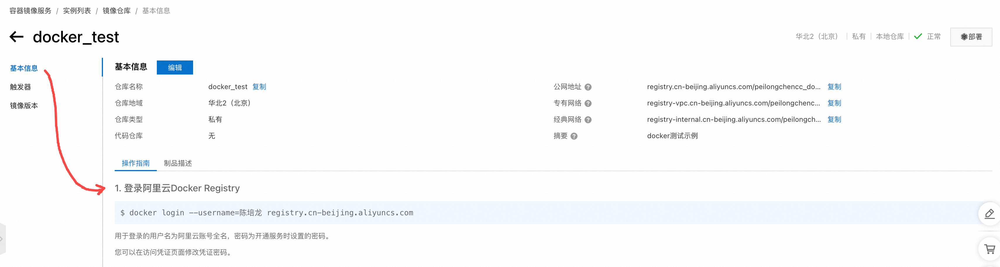
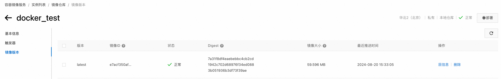

# 介绍将docker容器分享给他人

本章介绍如何将自己的docker容器分享给他人。
- [介绍将docker容器分享给他人](#介绍将docker容器分享给他人)
  - [前提条件:](#前提条件)
  - [方法 1:将镜像保存为 tar 文件](#方法-1将镜像保存为-tar-文件)
    - [1. 将容器打包成镜像(可选)](#1-将容器打包成镜像可选)
    - [2. 将镜像保存为 tar 文件](#2-将镜像保存为-tar-文件)
    - [3. 分享 tar 文件](#3-分享-tar-文件)
    - [4. 对方加载镜像并启动容器](#4-对方加载镜像并启动容器)
  - [方法 2:将镜像推送到 Docker Registry(例如阿里云ACR)](#方法-2将镜像推送到-docker-registry例如阿里云acr)
    - [1. 登录个人ACR:](#1-登录个人acr)
    - [2. 查看要上传的镜像:](#2-查看要上传的镜像)
    - [3. 为镜像打TAG:](#3-为镜像打tag)
    - [4. 上传镜像:](#4-上传镜像)
    - [5. 阿里云ACR查看效果:](#5-阿里云acr查看效果)
    - [6. 测试拉取:](#6-测试拉取)
    - [7. 启动拉取的docker镜像:](#7-启动拉取的docker镜像)
    - [8. 测试效果:](#8-测试效果)


## 前提条件:

假设你已经将你的应用程序打包成了一个docker，效果如下:

```bash
(base) root@iZ2zea5v77oawjy2qz7c20Z:/data/docker_tutorial# docker ps
CONTAINER ID   IMAGE            COMMAND                  CREATED        STATUS        PORTS                                       NAMES
dec75f4de335   my-fastapi-app   "/bin/bash -c '. doc…"   17 hours ago   Up 17 hours   0.0.0.0:8848->8848/tcp, :::8848->8848/tcp   jolly_cohen
```

通常有两种方法将Docker镜像分享给他人:


## 方法 1:将镜像保存为 tar 文件

### 1. 将容器打包成镜像(可选)

> [!NOTE]
> 如果你在容器运行后，没有对其进行更改，可以跳过这一节，直接使用 `docker save` 指令。

如果你在容器运行后对其进行了更改（比如安装软件、修改配置），这些更改不会自动反映在原始镜像中。因此，你需要使用 `docker commit` 将这些更改保存为一个新的镜像。可以参考下列指令:

```bash
docker commit <CONTAINER_ID> <your_image_name>
```

例如:

```bash
docker commit dec75f4de335 my-fastapi-app:latest
```

### 2. 将镜像保存为 tar 文件

使用 `docker save` 命令将镜像保存为一个 tar 文件:

```bash
docker save -o <path_to_output_tar_file> <your_image_name>
```

例如:

```bash
docker save -o my-fastapi-app.tar my-fastapi-app:latest
```

🚨注意:

`my-fastapi-app:latest` 对应的是 `docker ps` 显示的 `IMAGE`。如果你看过笔者写的[simple_example](../simple_example/README.md)章节，应该就理解对应关系了。

### 3. 分享 tar 文件

你可以通过任何文件传输方式（如网络分享、U盘等）将这个 tar 文件分享给其他人。如果你采用`scp`传输给他人的服务器，可以参考下列写法:

```bash
scp -P 13120 /Users/peilongchencc/Downloads/my-fastapi-app.tar root@js1.blockelite.cn:/root/data/
root@js1.blockelite.cn's password:
my-fastapi-app.tar                            100%  168MB   1.6MB/s   01:44
```

### 4. 对方加载镜像并启动容器

收到 tar 文件后，对方可以使用 `docker load` 加载镜像:

```bash
docker load -i <path_to_tar_file>
```

然后通过以下命令运行容器:

```bash
docker run -d -p 8848:8848 <your_image_name>
```

例如，笔者将`tar`文件传给另一台服务器后。终端运行下列指令加载镜像:

```bash
docker load -i my-fastapi-app.tar
```

终端显示:

```log
(base) root@ubuntu22:~/data# docker load -i my-fastapi-app.tar
9853575bc4f9: Loading layer [==================================================>]  77.83MB/77.83MB
c897e8952453: Loading layer [==================================================>]  9.539MB/9.539MB
29fa0c9cc49b: Loading layer [==================================================>]  35.32MB/35.32MB
fdf783cf2812: Loading layer [==================================================>]  4.608kB/4.608kB
3db20f592cb9: Loading layer [==================================================>]  12.28MB/12.28MB
272f89564662: Loading layer [==================================================>]  1.536kB/1.536kB
962fb116696f: Loading layer [==================================================>]  12.29kB/12.29kB
3c76de850261: Loading layer [==================================================>]  41.42MB/41.42MB
Loaded image: my-fastapi-app:latest
(base) root@ubuntu22:~/data#
```

终端运行下列指令启动容器:

```bash
docker run -d -p 8848:8848 my-fastapi-app:latest
```

终端显示:

```log
(base) root@ubuntu22:~/data# docker ps
CONTAINER ID   IMAGE     COMMAND   CREATED   STATUS    PORTS     NAMES
(base) root@ubuntu22:~/data# docker run -d -p 8848:8848 my-fastapi-app:latest
e81f4c27bd5670450ac7c677544292a9f4b5f8d55903c290c0cfd9a710545477
(base) root@ubuntu22:~/data# docker ps
CONTAINER ID   IMAGE                   COMMAND                   CREATED          STATUS          PORTS                                       NAMES
e81f4c27bd56   my-fastapi-app:latest   "/bin/bash -c '. doc…"   16 seconds ago   Up 14 seconds   0.0.0.0:8848->8848/tcp, :::8848->8848/tcp   quizzical_snyder
(base) root@ubuntu22:~/data# 
```


## 方法 2:将镜像推送到 Docker Registry(例如阿里云ACR)

### 1. 登录个人ACR:

登录方式可以在 **"镜像仓库"-->"基本信息"** 查看到，例如:



例如笔者的指令:

```bash
docker login --username=陈培龙 registry.cn-beijing.aliyuncs.com
```

终端效果:

```log
(base) root@iZ2zea5v77oawjy2qz7c20Z:/data# docker login --username=陈培龙 registry.cn-beijing.aliyuncs.com
Password: 
WARNING! Your password will be stored unencrypted in /root/.docker/config.json.
Configure a credential helper to remove this warning. See
https://docs.docker.com/engine/reference/commandline/login/#credentials-store

Login Succeeded
(base) root@iZ2zea5v77oawjy2qz7c20Z:/data#
```

🚨注意:

上述信息提示Docker 登录凭据（用户名和密码）将被未加密地存储在 `/root/.docker/config.json` 文件中。这是一个潜在的安全风险，因为如果其他人获得了对该文件的访问权，他们就能读取到这些凭据。

如果你是临时租用服务器，可以像笔者一样，退租服务器前输入下列指令删除Docker登陆凭证:

```bash
rm /root/.docker/config.json
```

### 2. 查看要上传的镜像:

```bash
docker ps
```

终端显示:

```bash
CONTAINER ID   IMAGE            COMMAND                  CREATED        STATUS        PORTS                                       NAMES
dec75f4de335   my-fastapi-app   "/bin/bash -c '. doc…"   22 hours ago   Up 22 hours   0.0.0.0:8848->8848/tcp, :::8848->8848/tcp   jolly_cohen
```

### 3. 为镜像打TAG:

```bash
docker tag my-fastapi-app:latest registry.cn-beijing.aliyuncs.com/peilongchencc_docker_hub/docker_test:latest
```

`my-fastapi-app:latest` 可替换为你的 **IMAGE**，`docker_test:latest` 中的 `latest` 可以替换为你的 **镜像版本号**。

终端显示:

```log
(base) root@iZ2zea5v77oawjy2qz7c20Z:/data# docker tag my-fastapi-app:latest registry.cn-beijing.aliyuncs.com/peilongchencc_docker_hub/docker_test:latest
(base) root@iZ2zea5v77oawjy2qz7c20Z:/data#
```

可能有读者很迷惑，为什么 `my-fastapi-app:latest` 已经携带了tag(`latest`)，为什么还要再打一次tag呢？而且还是不指定镜像名称的打tag方式？

**为什么再打一次tag:**

因为 `my-fastapi-app:latest` 中的tag(`latest`)是一个本地名称，在远程仓库没有记录。打第二次标签的目的是让 Docker 知道你要将本地镜像推送到远程仓库的哪个位置（完整路径）。没有这一步，Docker 无法知道 `my-fastapi-app:latest` 应该对应到远程仓库的哪个具体地址。

**为什么不指定镜像名称打tag:**

单一仓库，用于存储docker镜像的多个版本（标签），所以默认你要传入的镜像都是一个系列的镜像。

### 4. 上传镜像:

```bash
docker push registry.cn-beijing.aliyuncs.com/peilongchencc_docker_hub/docker_test:latest
```

终端显示:

```log
(base) root@iZ2zea5v77oawjy2qz7c20Z:/data# docker push registry.cn-beijing.aliyuncs.com/peilongchencc_docker_hub/docker_test:latest
The push refers to repository [registry.cn-beijing.aliyuncs.com/peilongchencc_docker_hub/docker_test]
3c76de850261: Pushed 
962fb116696f: Pushed 
272f89564662: Pushed 
3db20f592cb9: Pushed 
fdf783cf2812: Pushed 
29fa0c9cc49b: Pushed 
c897e8952453: Pushed 
9853575bc4f9: Pushed 
latest: digest: sha256:7a31f8df4eaebebbc4cb2cd1942c702d68976f34ed0883b051936b3df73f39ae size: 1996
(base) root@iZ2zea5v77oawjy2qz7c20Z:/data# 
```

从日志输出可以看出，已成功将本地的 Docker 镜像推送到了阿里云ACR的 `peilongchencc_docker_hub/docker_test` 仓库中。

### 5. 阿里云ACR查看效果:



### 6. 测试拉取:

如果你和笔者一样使用的私有docker仓库，记得先登录再拉取。

```bash
docker pull registry.cn-beijing.aliyuncs.com/peilongchencc_docker_hub/docker_test:latest
```

终端显示:

```log
(base) root@ubuntu22:~/data# docker pull registry.cn-beijing.aliyuncs.com/peilongchencc_docker_hub/docker_test:latest
latest: Pulling from peilongchencc_docker_hub/docker_test
Digest: sha256:7a31f8df4eaebebbc4cb2cd1942c702d68976f34ed0883b051936b3df73f39ae
Status: Downloaded newer image for registry.cn-beijing.aliyuncs.com/peilongchencc_docker_hub/docker_test:latest
registry.cn-beijing.aliyuncs.com/peilongchencc_docker_hub/docker_test:latest
(base) root@ubuntu22:~/data# 
```

从日志中可以看到，镜像的 SHA256 摘要值，以及拉取镜像的状态是“Downloaded newer image”，说明你成功拉取到了最新版本的镜像。

### 7. 启动拉取的docker镜像:

```bash
docker run -d -p 8848:8848 registry.cn-beijing.aliyuncs.com/peilongchencc_docker_hub/docker_test:latest
```

> 阿里云 ACR 镜像的完整名称相对较长，这个指令是正确的。

终端显示:

```log
(base) root@ubuntu22:~/data# docker ps
CONTAINER ID   IMAGE     COMMAND   CREATED   STATUS    PORTS     NAMES
(base) root@ubuntu22:~/data# docker ps -a
CONTAINER ID   IMAGE     COMMAND   CREATED   STATUS    PORTS     NAMES
(base) root@ubuntu22:~/data# docker run -d -p 8848:8848 registry.cn-beijing.aliyuncs.com/peilongchencc_docker_hub/docker_test:latest
05524a107b6e05ff1338e67e8acce5c49fe3eeca6a6aa7aa6a6c4734b096551e
(base) root@ubuntu22:~/data# docker ps
CONTAINER ID   IMAGE                                                                          COMMAND                   CREATED         STATUS         PORTS                                       NAMES
05524a107b6e   registry.cn-beijing.aliyuncs.com/peilongchencc_docker_hub/docker_test:latest   "/bin/bash -c '. doc…"   7 seconds ago   Up 5 seconds   0.0.0.0:8848->8848/tcp, :::8848->8848/tcp   laughing_leavitt
(base) root@ubuntu22:~/data#
```

### 8. 测试效果:

测试 POST 请求 (`/items/`):

```bash
curl -X POST "http://localhost:8848/items/" -H "Content-Type: application/json" -d '{"name": "apple", "description": "A juicy fruit", "price": 1.5, "tax": 0.1}'
```

终端显示:

```log
{"item":{"name":"apple","description":"A juicy fruit","price":1.5,"tax":0.1}}
```

成功！可喜可贺🎉🎉🎉