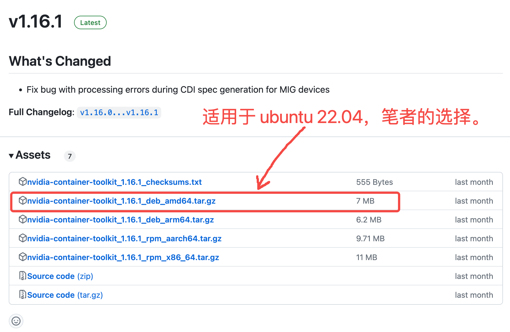

# Docker识别并使用GPU

本章以[Docker启动 LLaMA-Factory 为例](https://github.com/peilongchencc/My-LLaMA-Factory/tree/main/cuda_docker_run)，讲解如何在Docker中使用GPU。
- [Docker识别并使用GPU](#docker识别并使用gpu)
  - [问题描述:](#问题描述)
  - [nvidia-container-toolkit安装:](#nvidia-container-toolkit安装)
    - [方法一: nvidia官方提供的安装方式:](#方法一-nvidia官方提供的安装方式)
      - [1. 配置代码仓库:](#1-配置代码仓库)
      - [2. 更新包列表:](#2-更新包列表)
      - [3. 安装NVIDIA Container Toolkit:](#3-安装nvidia-container-toolkit)
    - [方法二: 手动安装NVIDIA Container Toolkit:](#方法二-手动安装nvidia-container-toolkit)
      - [1. 下载安装包:](#1-下载安装包)
      - [2. 将安装包上传到服务器:](#2-将安装包上传到服务器)
      - [3. 解压文件:](#3-解压文件)
      - [4. 按依赖顺序安装 .deb 文件:](#4-按依赖顺序安装-deb-文件)
      - [5. 验证安装:](#5-验证安装)
  - [Docker 配置文件修改:](#docker-配置文件修改)
    - [测试效果:](#测试效果)


## 问题描述:

如果你在以Docker方式部署llamafactory后，发现无法启动llamafactory容器，且错误如下:

> 笔者使用的 ubuntu 22.04

```log
(base) root@ubuntu22:~/data/LLaMA-Factory-main# cd docker/docker-cuda/
(base) root@ubuntu22:~/data/LLaMA-Factory-main/docker/docker-cuda# docker compose up -d
[+] Running 0/1
 ⠼ Container llamafactory  Starting                                                                                                                                                                                    0.5s 
Error response from daemon: could not select device driver "nvidia" with capabilities: [[gpu]]
(base) root@ubuntu22:~/data/LLaMA-Factory-main/docker/docker-cuda# docker ps
CONTAINER ID   IMAGE     COMMAND   CREATED   STATUS    PORTS     NAMES
(base) root@ubuntu22:~/data/LLaMA-Factory-main/docker/docker-cuda# docker images
```

🚨这是因为你的服务器没有配置 **"显卡直通"** ，Docker容器无法识别、使用GPU。

解决方案:

1. 安装 **"nvidia-container-toolkit"**。
2. 修改 Docker 的配置文件（通常是 `/etc/docker/daemon.json`），让Docker 能够识别并使用 GPU 。


## nvidia-container-toolkit安装:

可以从以下两种方法中任选其一，下载、安装 **"nvidia-container-toolkit"**:

### 方法一: nvidia官方提供的安装方式:

如果你的服务器能够正常从nvidia官方获取资源，那就非常方便了。按以下步骤操作即可:

> 详细信息可访问[nvidia-container-toolkit官网链接](https://docs.nvidia.com/datacenter/cloud-native/container-toolkit/latest/install-guide.html#installing-the-nvidia-container-toolkit)查看。

#### 1. 配置代码仓库:

```bash
curl -fsSL https://nvidia.github.io/libnvidia-container/gpgkey | sudo gpg --dearmor -o /usr/share/keyrings/nvidia-container-toolkit-keyring.gpg \
  && curl -s -L https://nvidia.github.io/libnvidia-container/stable/deb/nvidia-container-toolkit.list | \
    sed 's#deb https://#deb [signed-by=/usr/share/keyrings/nvidia-container-toolkit-keyring.gpg] https://#g' | \
    sudo tee /etc/apt/sources.list.d/nvidia-container-toolkit.list
```

#### 2. 更新包列表:

```bash
sudo apt update
```

#### 3. 安装NVIDIA Container Toolkit:

```bash
sudo apt-get install -y nvidia-container-toolkit
```

这就成功安装 **"nvidia-container-toolkit"** 了～

### 方法二: 手动安装NVIDIA Container Toolkit:

如果你和笔者一样服务器网络受限，无法拉取类似 "https://nvidia.github.io" 的网址。那就需要手动下载 **NVIDIA Container Toolkit** 进行安装了。步骤如下:

#### 1. 下载安装包:

请根据以下网址访问NVIDIA Container Toolkit的GitHub，选择自己系统对应的安装包:

```log
https://github.com/NVIDIA/nvidia-container-toolkit/releases
```




#### 2. 将安装包上传到服务器:

根据个人习惯，使用 `scp` 或 vscode 界面拖拉上传文件到 **任意位置**。

#### 3. 解压文件:

如果你和笔者使用的相同的安装包，可以使用下列指令:

```bash
tar -xvf nvidia-container-toolkit_1.16.1_deb_amd64.tar.gz
```

解压后，效果如下:

```log
(base) root@ubuntu22:~/data# tar -xvf nvidia-container-toolkit_1.16.1_deb_amd64.tar.gz
release-v1.16.1-stable/packages/ubuntu18.04/amd64/libnvidia-container-dev_1.16.1-1_amd64.deb
release-v1.16.1-stable/packages/ubuntu18.04/amd64/libnvidia-container-tools_1.16.1-1_amd64.deb
release-v1.16.1-stable/packages/ubuntu18.04/amd64/libnvidia-container1-dbg_1.16.1-1_amd64.deb
release-v1.16.1-stable/packages/ubuntu18.04/amd64/libnvidia-container1_1.16.1-1_amd64.deb
release-v1.16.1-stable/packages/ubuntu18.04/amd64/nvidia-container-toolkit-base_1.16.1-1_amd64.deb
release-v1.16.1-stable/packages/ubuntu18.04/amd64/nvidia-container-toolkit-operator-extensions_1.16.1-1_amd64.deb
release-v1.16.1-stable/packages/ubuntu18.04/amd64/nvidia-container-toolkit_1.16.1-1_amd64.deb
(base) root@ubuntu22:~/data# 
```

#### 4. 按依赖顺序安装 .deb 文件:

```bash
sudo dpkg -i release-v1.16.1-stable/packages/ubuntu18.04/amd64/libnvidia-container1_1.16.1-1_amd64.deb \
release-v1.16.1-stable/packages/ubuntu18.04/amd64/libnvidia-container-tools_1.16.1-1_amd64.deb \
release-v1.16.1-stable/packages/ubuntu18.04/amd64/libnvidia-container-dev_1.16.1-1_amd64.deb \
release-v1.16.1-stable/packages/ubuntu18.04/amd64/nvidia-container-toolkit-base_1.16.1-1_amd64.deb \
release-v1.16.1-stable/packages/ubuntu18.04/amd64/nvidia-container-toolkit_1.16.1-1_amd64.deb
```

终端显示:

```log
(base) root@ubuntu22:~/data# sudo dpkg -i release-v1.16.1-stable/packages/ubuntu18.04/amd64/libnvidia-container1_1.16.1-1_amd64.deb \
release-v1.16.1-stable/packages/ubuntu18.04/amd64/libnvidia-container-tools_1.16.1-1_amd64.deb \
release-v1.16.1-stable/packages/ubuntu18.04/amd64/libnvidia-container-dev_1.16.1-1_amd64.deb \
release-v1.16.1-stable/packages/ubuntu18.04/amd64/nvidia-container-toolkit-base_1.16.1-1_amd64.deb \
release-v1.16.1-stable/packages/ubuntu18.04/amd64/nvidia-container-toolkit_1.16.1-1_amd64.deb
正在选中未选择的软件包 libnvidia-container1:amd64。
(正在读取数据库 ... 系统当前共安装有 218002 个文件和目录。)
准备解压 .../libnvidia-container1_1.16.1-1_amd64.deb  ...
正在解压 libnvidia-container1:amd64 (1.16.1-1) ...
正在选中未选择的软件包 libnvidia-container-tools。
准备解压 .../libnvidia-container-tools_1.16.1-1_amd64.deb  ...
正在解压 libnvidia-container-tools (1.16.1-1) ...
正在选中未选择的软件包 libnvidia-container-dev:amd64。
准备解压 .../libnvidia-container-dev_1.16.1-1_amd64.deb  ...
正在解压 libnvidia-container-dev:amd64 (1.16.1-1) ...
正在选中未选择的软件包 nvidia-container-toolkit-base。
准备解压 .../nvidia-container-toolkit-base_1.16.1-1_amd64.deb  ...
正在解压 nvidia-container-toolkit-base (1.16.1-1) ...
正在选中未选择的软件包 nvidia-container-toolkit。
准备解压 .../nvidia-container-toolkit_1.16.1-1_amd64.deb  ...
正在解压 nvidia-container-toolkit (1.16.1-1) ...
正在设置 libnvidia-container1:amd64 (1.16.1-1) ...
正在设置 libnvidia-container-tools (1.16.1-1) ...
正在设置 libnvidia-container-dev:amd64 (1.16.1-1) ...
正在设置 nvidia-container-toolkit-base (1.16.1-1) ...
正在设置 nvidia-container-toolkit (1.16.1-1) ...
正在处理用于 libc-bin (2.35-0ubuntu3.1) 的触发器 ...
(base) root@ubuntu22:~/data#
```

#### 5. 验证安装:

安装完成后，可以通过以下命令验证 NVIDIA Container Toolkit 是否正确安装：

```bash
nvidia-container-cli --version
```

终端显示:

```log
(base) root@ubuntu22:~/data# nvidia-container-cli --version
cli-version: 1.16.1
lib-version: 1.16.1
build date: 2024-07-23T14:57+00:00
build revision: 4c2494f16573b585788a42e9c7bee76ecd48c73d
build compiler: x86_64-linux-gnu-gcc-7 7.5.0
build platform: x86_64
build flags: -D_GNU_SOURCE -D_FORTIFY_SOURCE=2 -DNDEBUG -std=gnu11 -O2 -g -fdata-sections -ffunction-sections -fplan9-extensions -fstack-protector -fno-strict-aliasing -fvisibility=hidden -Wall -Wextra -Wcast-align -Wpointer-arith -Wmissing-prototypes -Wnonnull -Wwrite-strings -Wlogical-op -Wformat=2 -Wmissing-format-attribute -Winit-self -Wshadow -Wstrict-prototypes -Wunreachable-code -Wconversion -Wsign-conversion -Wno-unknown-warning-option -Wno-format-extra-args -Wno-gnu-alignof-expression -Wl,-zrelro -Wl,-znow -Wl,-zdefs -Wl,--gc-sections
(base) root@ubuntu22:~/data# 
```

现在，你已经成功安装了 NVIDIA Container Toolkit 1.16.1，并正确配置了环境。根据 `nvidia-container-cli --version` 的输出，工具包已经正确安装并可以正常使用。


## Docker 配置文件修改:

1. 使用 `nvidia-ctk` 命令配置容器运行时：

```bash
sudo nvidia-ctk runtime configure --runtime=docker
```

此命令会修改主机上的 `/etc/docker/daemon.json` 文件，以便 Docker 可以使用 NVIDIA 容器运行时。例如:

```log
(base) root@ubuntu22:~/data/LLaMA-Factory-main/docker/docker-cuda# cat /etc/docker/daemon.json
{
    "runtimes": {
        "nvidia": {
            "args": [],
            "path": "nvidia-container-runtime"
        }
    }
}
(base) root@ubuntu22:~/data/LLaMA-Factory-main/docker/docker-cuda# 
```

2. 重启 Docker:

```bash
sudo systemctl restart docker
```

终端显示:

```log
(base) root@ubuntu22:~/data/LLaMA-Factory-main/docker/docker-cuda# sudo nvidia-ctk runtime configure --runtime=docker
WARN[0000] Ignoring runtime-config-override flag for docker 
INFO[0000] Config file does not exist; using empty config 
INFO[0000] Wrote updated config to /etc/docker/daemon.json 
INFO[0000] It is recommended that docker daemon be restarted. 
(base) root@ubuntu22:~/data/LLaMA-Factory-main/docker/docker-cuda# sudo systemctl restart docker
(base) root@ubuntu22:~/data/LLaMA-Factory-main/docker/docker-cuda# 
```

### 测试效果:

安装 **"nvidia-container-toolkit"**，并修改 Docker 的配置文件后，我们测试下效果:

💢💢💢安装前:

```log
(base) root@ubuntu22:~/data/LLaMA-Factory-main/docker/docker-cuda# docker compose up -d
[+] Running 0/1
 ⠸ Container llamafactory  Starting                                                                                                                                     0.4s 
Error response from daemon: could not select device driver "nvidia" with capabilities: [[gpu]]
(base) root@ubuntu22:~/data/LLaMA-Factory-main/docker/docker-cuda#
```

⬇️⬇️⬇️安装后:

```log
(base) root@ubuntu22:~/data/LLaMA-Factory-main/docker/docker-cuda# docker compose up -d
[+] Running 1/1
 ✔ Container llamafactory  Started                                                                                                                                     11.0s 
(base) root@ubuntu22:~/data/LLaMA-Factory-main/docker/docker-cuda# docker images
REPOSITORY                 TAG       IMAGE ID       CREATED          SIZE
docker-cuda-llamafactory   latest    c11dc2063efa   45 minutes ago   22.7GB
(base) root@ubuntu22:~/data/LLaMA-Factory-main/docker/docker-cuda# 
```