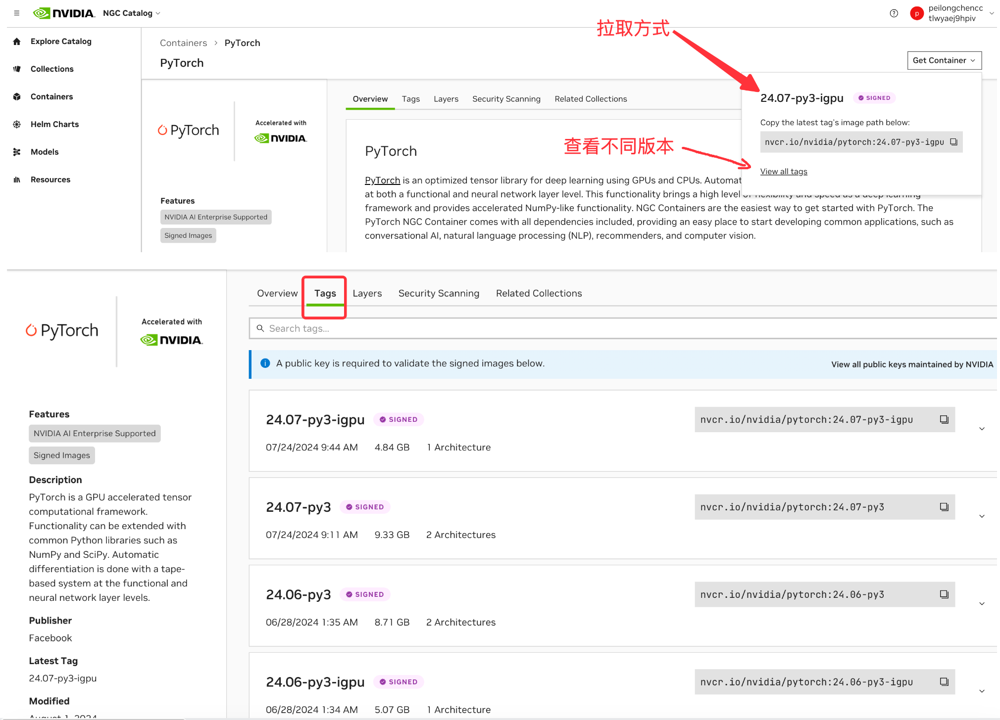

# Docerfile 语法

Dockerfile 是用于定义 Docker 镜像的文件。它包含了一系列指令，这些指令指定了如何从基础镜像开始，构建出一个包含应用程序和所需依赖的自定义镜像。

本章以 `LLaMA-Factory` 中的 Dockerfile 为例，讲解 Dockerfile 的构建语法。
- [Docerfile 语法](#docerfile-语法)
  - [LLaMA-Factory中的Dockerfile源文件:](#llama-factory中的dockerfile源文件)
  - [LLaMA-Factory中的Dockerfile解析:](#llama-factory中的dockerfile解析)
    - [Dockerfile 的作用](#dockerfile-的作用)
    - [逐行解析 Dockerfile](#逐行解析-dockerfile)
      - [1. 指定基础镜像](#1-指定基础镜像)
      - [2. 设置环境变量](#2-设置环境变量)
      - [3. 定义构建参数](#3-定义构建参数)
      - [4. 设置工作目录](#4-设置工作目录)
      - [5. 复制文件](#5-复制文件)
      - [6. 安装依赖](#6-安装依赖)
      - [7. 复制项目文件](#7-复制项目文件)
      - [8. 执行自定义安装脚本](#8-执行自定义安装脚本)
      - [9. 重建特定组件](#9-重建特定组件)
      - [10. 设置卷（Volumes）](#10-设置卷volumes)
      - [`docker-compose.yml` 中的 `volumes`:](#docker-composeyml-中的-volumes)
      - [11. 暴露端口](#11-暴露端口)
    - [总结](#总结)
  - [附录: 常用的docker资源网站](#附录-常用的docker资源网站)
    - [1. Docker Hub](#1-docker-hub)
    - [2. NVIDIA NGC (NVIDIA GPU Cloud)](#2-nvidia-ngc-nvidia-gpu-cloud)
    - [3. Quay.io](#3-quayio)
    - [4. GitHub Container Registry](#4-github-container-registry)
    - [5. Google Container Registry (GCR)](#5-google-container-registry-gcr)
    - [镜像源的默认拉取:](#镜像源的默认拉取)
    - [如何判断镜像来源](#如何判断镜像来源)


## LLaMA-Factory中的Dockerfile源文件:

以下内容源自著名GitHub项目 **LLaMA-Factory** 中的 [`docker/docker-cuda/Dockerfile`](https://github.com/hiyouga/LLaMA-Factory/blob/main/docker/docker-cuda/Dockerfile)。

```Dockerfile
# Use the NVIDIA official image with PyTorch 2.3.0
# https://docs.nvidia.com/deeplearning/frameworks/pytorch-release-notes/rel-24-02.html
FROM nvcr.io/nvidia/pytorch:24.02-py3

# Define environments
ENV MAX_JOBS=4
ENV FLASH_ATTENTION_FORCE_BUILD=TRUE
ENV VLLM_WORKER_MULTIPROC_METHOD=spawn

# Define installation arguments
ARG INSTALL_BNB=false
ARG INSTALL_VLLM=false
ARG INSTALL_DEEPSPEED=false
ARG INSTALL_FLASHATTN=false
ARG PIP_INDEX=https://pypi.org/simple

# Set the working directory
WORKDIR /app

# Install the requirements
COPY requirements.txt /app
RUN pip config set global.index-url "$PIP_INDEX" && \
    pip config set global.extra-index-url "$PIP_INDEX" && \
    python -m pip install --upgrade pip && \
    python -m pip install -r requirements.txt

# Copy the rest of the application into the image
COPY . /app

# Install the LLaMA Factory
RUN EXTRA_PACKAGES="metrics"; \
    if [ "$INSTALL_BNB" == "true" ]; then \
        EXTRA_PACKAGES="${EXTRA_PACKAGES},bitsandbytes"; \
    fi; \
    if [ "$INSTALL_VLLM" == "true" ]; then \
        EXTRA_PACKAGES="${EXTRA_PACKAGES},vllm"; \
    fi; \
    if [ "$INSTALL_DEEPSPEED" == "true" ]; then \
        EXTRA_PACKAGES="${EXTRA_PACKAGES},deepspeed"; \
    fi; \
    pip install -e ".[$EXTRA_PACKAGES]"

# Rebuild flash attention
RUN pip uninstall -y transformer-engine flash-attn && \
    if [ "$INSTALL_FLASHATTN" == "true" ]; then \
        pip uninstall -y ninja && pip install ninja && \
        pip install --no-cache-dir flash-attn --no-build-isolation; \
    fi

# Set up volumes
VOLUME [ "/root/.cache/huggingface", "/root/.cache/modelscope", "/app/data", "/app/output" ]

# Expose port 7860 for the LLaMA Board
ENV GRADIO_SERVER_PORT 7860
EXPOSE 7860

# Expose port 8000 for the API service
ENV API_PORT 8000
EXPOSE 8000
```


## LLaMA-Factory中的Dockerfile解析:

理解 `Dockerfile` 的构建过程可能比较复杂，但我们可以一步步地拆解每条指令，并用简单的语言来解释。这是一个重要的基础，因为通过学习这些指令，你可以轻松地创建和管理 Docker 容器。

### Dockerfile 的作用

`Dockerfile` 是一个包含一系列指令的文本文件，这些指令定义了如何构建一个 Docker 镜像。每个指令都是对最终镜像的一步操作。例如，你可以指定基础镜像、复制文件、运行命令、安装软件等。

### 逐行解析 Dockerfile

让我们从头开始，逐行解释这个 `LLaMA-Factory` 的 `Dockerfile`。

#### 1. 指定基础镜像

```Dockerfile
FROM nvcr.io/nvidia/pytorch:24.02-py3
```

- **作用**：`FROM` 指令指定你要基于哪个基础镜像构建新镜像。你可以把基础镜像想象成你开始搭建房子时使用的地基。在这个例子中，我们使用的是一个包含了 PyTorch 和 NVIDIA 驱动支持的镜像。这是构建深度学习环境的基础。

NGC中pytorch镜像不同版本拉取方式如下:



#### 2. 设置环境变量

```Dockerfile
ENV MAX_JOBS=4
ENV FLASH_ATTENTION_FORCE_BUILD=TRUE
ENV VLLM_WORKER_MULTIPROC_METHOD=spawn
```

- **作用**：`ENV` 指令定义了环境变量。这些变量会在构建镜像时以及运行容器时使用。
    - `MAX_JOBS=4`：设置并行工作的最大任务数为 4。
    - `FLASH_ATTENTION_FORCE_BUILD=TRUE`：强制重建 `Flash Attention` 库。
    - `VLLM_WORKER_MULTIPROC_METHOD=spawn`：设置多进程的启动方式。

- **为什么使用环境变量？**：使用环境变量可以使配置更灵活。你可以在不同的场景中改变这些变量，而无需修改代码。

#### 3. 定义构建参数

```Dockerfile
ARG INSTALL_BNB=false
ARG INSTALL_VLLM=false
ARG INSTALL_DEEPSPEED=false
ARG INSTALL_FLASHATTN=false
ARG PIP_INDEX=https://pypi.org/simple
```

- **作用**：`ARG` 定义了构建时的参数。与 `ENV` 不同，`ARG` 只在构建时有效。
    - 这些参数用于决定是否安装额外的软件包，例如 `INSTALL_BNB` 可以控制是否安装 `bitsandbytes` 库。
    - `PIP_INDEX` 指定了 Python 包的下载源。

- **为什么使用构建参数？**：这让你在构建镜像时更加灵活，可以根据需要选择性地安装不同的依赖。

#### 4. 设置工作目录

```Dockerfile
WORKDIR /app
```

- **作用**：`WORKDIR` 指定了后续指令执行的工作目录。它相当于在 Linux 里执行了 `cd /app`，表示之后的所有操作都在 `/app` 目录下进行。

- **为什么设置工作目录？**：这样可以保证所有操作都在一个你预期的位置进行，方便管理文件和路径。

#### 5. 复制文件

```Dockerfile
COPY requirements.txt /app
```

- **作用**：`COPY` 指令将文件从你的计算机（宿主机）复制到镜像中。在这里，我们将 `requirements.txt` 复制到 `/app` 目录中。

- **为什么复制文件？**：镜像需要包含运行应用程序所需的所有文件，`COPY` 是实现这一点的基本手段。

#### 6. 安装依赖

```Dockerfile
RUN pip config set global.index-url "$PIP_INDEX" && \
    pip config set global.extra-index-url "$PIP_INDEX" && \
    python -m pip install --upgrade pip && \
    python -m pip install -r requirements.txt
```

- **作用**：`RUN` 指令用于执行命令。在这里，使用 `pip` 安装 Python 依赖。它执行了多个命令：
    - 设置 `pip` 的下载源为 `PIP_INDEX`。
    - 升级 `pip` 工具。
    - 根据 `requirements.txt` 安装所需的 Python 库。

- **为什么使用 `RUN`？**：通过 `RUN` 指令，你可以在镜像中安装软件包、编译代码等。这些操作是镜像构建的重要组成部分。

#### 7. 复制项目文件

```Dockerfile
COPY . /app
```

- **作用**：再次使用 `COPY` 指令，将你当前项目目录中的所有文件复制到镜像的 `/app` 目录下。

- **为什么要复制整个项目？**：你需要把项目的所有代码和资源都包含在镜像中，这样它才能在容器中运行。

#### 8. 执行自定义安装脚本

```Dockerfile
RUN EXTRA_PACKAGES="metrics"; \
    if [ "$INSTALL_BNB" == "true" ]; then \
        EXTRA_PACKAGES="${EXTRA_PACKAGES},bitsandbytes"; \
    fi; \
    if [ "$INSTALL_VLLM" == "true" ]; then \
        EXTRA_PACKAGES="${EXTRA_PACKAGES},vllm"; \
    fi; \
    if [ "$INSTALL_DEEPSPEED" == "true" ]; then \
        EXTRA_PACKAGES="${EXTRA_PACKAGES},deepspeed"; \
    fi; \
    pip install -e ".[$EXTRA_PACKAGES]"
```

- **作用**：这个 `RUN` 指令执行一个复杂的 Shell 脚本。它根据构建参数安装不同的 Python 包。比如，如果 `INSTALL_BNB` 为 `true`，就会安装 `bitsandbytes`。

- **为什么使用 Shell 脚本？**：Shell 脚本可以让你的构建流程更加灵活。根据不同的构建条件，执行不同的操作。

#### 9. 重建特定组件

```Dockerfile
RUN pip uninstall -y transformer-engine flash-attn && \
    if [ "$INSTALL_FLASHATTN" == "true" ]; then \
        pip uninstall -y ninja && pip install ninja && \
        pip install --no-cache-dir flash-attn --no-build-isolation; \
    fi
```

- **作用**：这个 `RUN` 指令用于重建和安装 `flash-attn`，前提是 `INSTALL_FLASHATTN` 参数为 `true`。

- **为什么执行这个操作？**：某些软件包可能需要特定的版本或重新编译，以确保与项目兼容。

#### 10. 设置卷（Volumes）

```Dockerfile
VOLUME [ "/root/.cache/huggingface", "/root/.cache/modelscope", "/app/data", "/app/output" ]
```

**作用**：

`VOLUME` 指令声明容器中某些目录为卷。这些目录需要持久化存储，即使容器停止或删除，数据也不会丢失。

  - 即在宿主机的 `/var/lib/docker/volumes/` 目录下创建一个随机的子目录存储这些信息。

  - 例如，`/app/data` 用于存储数据集，`/app/output` 用于保存运行结果。

**为什么设置卷？**：

卷用于数据持久化或共享。如果你不设置卷，容器内的数据会在容器销毁时丢失。

#### `docker-compose.yml` 中的 `volumes`:

如果你只使用 `Dockerfile` 声明 `VOLUME`，会在宿主机的 `/var/lib/docker/volumes/` 目录下创建一个随机的子目录存储这些信息。很多人会感到查看非常不方便，所以很多人会选择配合 `docker-compose.yml` 使用。

`docker-compose.yml` 中的 `volumes` 用来指定 `VOLUME`(Dockerfile中的) 保存在宿主机的位置(目录)。

🚨注意: 在 `docker-compose.yml` 中使用相对路径时，Docker 会根据 `docker-compose.yml` 所在的目录来解析这个路径。

以下内容节选自 LLaMA-Factory 的 `docker-cuda/docker-compose.yml` 文件:

```
services:
  llamafactory:
    volumes:
      - ../../hf_cache:/root/.cache/huggingface
      - ../../ms_cache:/root/.cache/modelscope
      - ../../data:/app/data
      - ../../output:/app/output
```

举例说明：

`../../output:/app/output` 表示将 `/app/output` 数据存在 `LLaMA-Factory/output`。

#### 11. 暴露端口

```Dockerfile
EXPOSE 7860
EXPOSE 8000
```

- **作用**：`EXPOSE` 指令告诉 Docker 这个镜像会监听哪些端口。这并不会真正开放端口，而是标记这些端口可以被访问。

- **为什么暴露端口？**：暴露端口允许外部服务（如浏览器或 API 调用）与容器进行通信。例如，`7860` 端口可能用于 Web UI，`8000` 端口可能用于 API。

### 总结

1. **基础镜像 (`FROM`)**：定义了构建的基础，确保拥有你需要的基本环境。
2. **环境变量 (`ENV`) 和构建参数 (`ARG`)**：用于控制和配置镜像的构建过程。
3. **工作目录 (`WORKDIR`) 和文件复制 (`COPY`)**：设置工作区域并复制必要的文件。
4. **安装依赖和执行脚本 (`RUN`)**：安装软件和执行配置任务，确保镜像内环境配置正确。
5. **数据卷 (`VOLUME`) 和端口 (`EXPOSE`)**：用于管理数据和开放服务访问。

通过 `Dockerfile`，你可以把整个开发环境打包成一个可复制、可部署的镜像。理解这些基础后，你可以根据需求自定义和优化自己的 `Dockerfile`。


## 附录: 常用的docker资源网站

常用的 Docker 镜像资源网站有以下几个：

### 1. Docker Hub

Docker Hub 是最常用的 Docker 镜像存储库，包含了大量官方和社区维护的镜像。大部分主流的开源项目都会在 Docker Hub 上发布官方镜像，例如 `nginx`、`mysql`、`python` 等。【[Docker Hub](https://hub.docker.com/)】

### 2. NVIDIA NGC (NVIDIA GPU Cloud)

这是 NVIDIA 的官方资源平台，提供专门优化的深度学习、机器学习和高性能计算的 Docker 镜像，特别适合需要 GPU 加速的场景。例如，`nvcr.io/nvidia/pytorch` 镜像就来自这个平台。【[NVIDIA NGC](https://ngc.nvidia.com/catalog/containers)】

### 3. Quay.io

Quay.io 是 Red Hat 维护的一个容器镜像存储库，提供了高安全性和企业级支持，适合需要高度稳定性和安全性需求的项目。【[Quay.io](https://quay.io/)】

### 4. GitHub Container Registry

GitHub 允许用户直接将容器镜像发布到 GitHub Packages，适合与 GitHub 项目紧密集成的场景。【[GitHub Container Registry](https://github.com/features/packages)】

### 5. Google Container Registry (GCR)

GCR 是 Google 提供的 Docker 镜像存储服务，集成了 Google Cloud Platform (GCP)，适合云原生和大规模分布式应用场景。【[Google Container Registry](https://cloud.google.com/container-registry)】

这些平台涵盖了从个人项目到企业级应用的多种需求，可以根据项目的具体要求选择合适的平台。

### 镜像源的默认拉取:

🚨注意: 如果在 `Dockerfile` 或 `docker-compose.yml` 文件中没有指定镜像的注册服务器（如 `nvcr.io`、`quay.io` 等），默认情况下，Docker 会从 Docker Hub 拉取镜像。

例如，以下 `Dockerfile` 会从 Docker Hub 拉取 `python:3.9` 镜像：

```Dockerfile
FROM python:3.9
```

在这里，`python:3.9` 没有指定注册服务器，所以 Docker 会默认从 Docker Hub 上拉取这个镜像。

同样，如果在 `docker-compose.yml` 中写了类似的配置：

```yaml
services:
  app:
    image: python:3.9
```

Docker 也会从 Docker Hub 获取该镜像。

### 如何判断镜像来源

- **没有前缀**：默认从 Docker Hub 拉取。
- **带有前缀**：根据前缀判断来源，例如 `nvcr.io`（NVIDIA NGC）、`gcr.io`（Google Container Registry）、`quay.io`（Quay）等。

这种机制简化了镜像管理，但同时也要注意从官方和可信源拉取镜像，以确保安全性和稳定性。