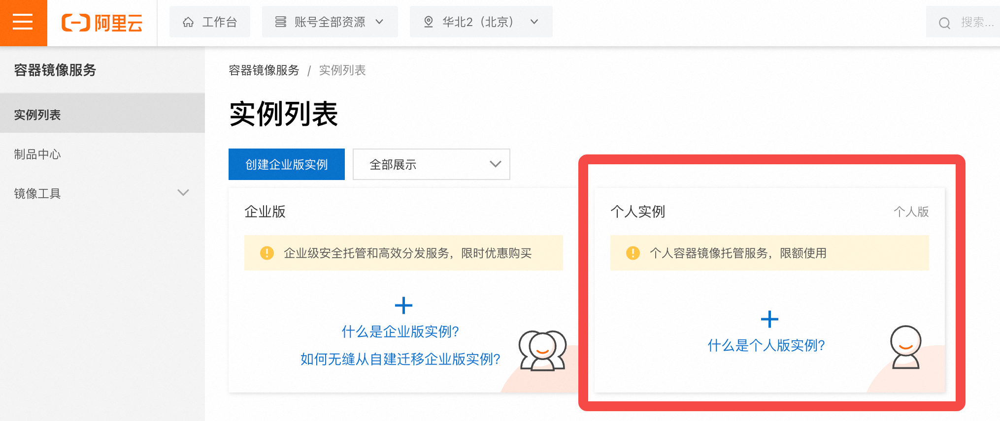
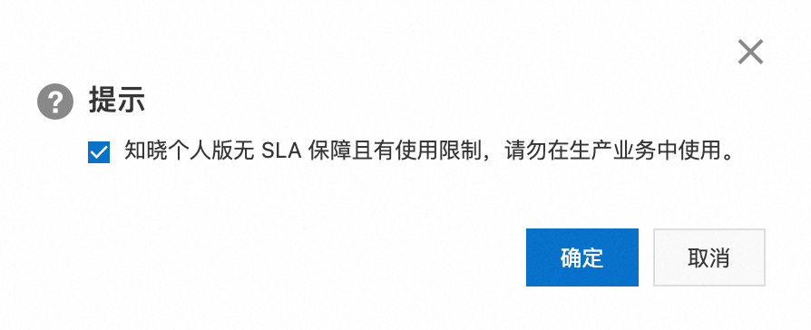

# 介绍如何创建个人ACR

阿里云容器镜像服务(Alibaba Cloud Container Registry)，简称ACR。个人版免费，企业版收费。
- [介绍如何创建个人ACR](#介绍如何创建个人acr)
  - [阿里云ACR产品首页选择 "管理控制台"](#阿里云acr产品首页选择-管理控制台)
  - [选择 "个人实例":](#选择-个人实例)
  - [创建个人版:](#创建个人版)
  - [创建镜像仓库密码](#创建镜像仓库密码)


## 阿里云ACR产品首页选择 "管理控制台"

根据下列网址进入阿里云ACR产品首页，然后选择 "管理控制台" :

> 如果选择 "立即购买"，进入的是企业版ACR购买界面。

```log
https://www.aliyun.com/product/acr/
```


## 选择 "个人实例":




## 创建个人版:


会提示有使用限制，勾选即可:



解释:

SLA（Service Level Agreement，服务级别协议）是云服务商对用户的服务可用性和可靠性做出的承诺。没有 SLA 保障意味着阿里云不会对个人版服务的可用性、可靠性或故障恢复时间做出任何正式承诺。

有使用限制：个人版通常有功能和资源的限制，比如存储容量、并发请求数、网络带宽等。这些限制可能影响你对服务的使用，尤其在高负载或高需求的场景下。


## 创建镜像仓库密码

正常根据提示创建镜像仓库密码即可。