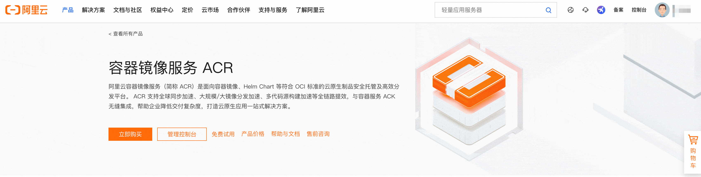
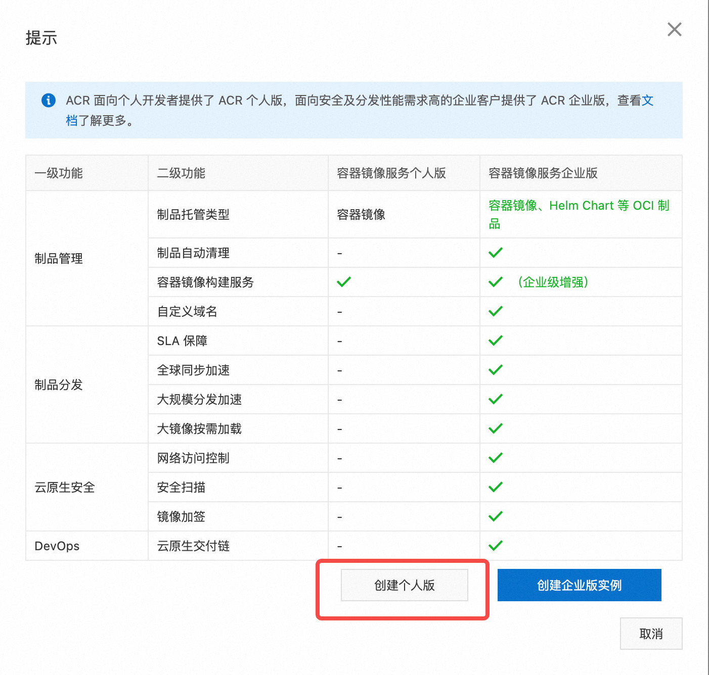
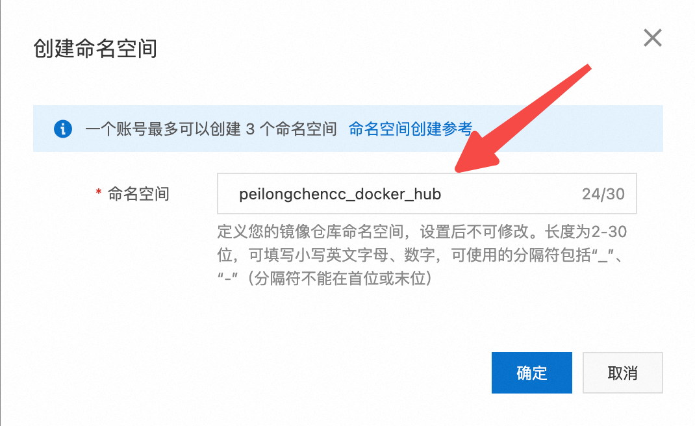

# 介绍如何创建个人ACR

阿里云容器镜像服务(Alibaba Cloud Container Registry)，简称ACR。个人版免费，企业版收费。

- [介绍如何创建个人ACR](#介绍如何创建个人acr)
  - [阿里云ACR介绍:](#阿里云acr介绍)
    - [ACR 的功能总结:](#acr-的功能总结)
    - [工作流程:](#工作流程)
    - [应用场景:](#应用场景)
    - [总结:](#总结)
  - [创建阿里云个人ACR流程:](#创建阿里云个人acr流程)
    - [1. 阿里云ACR产品首页选择 "管理控制台":](#1-阿里云acr产品首页选择-管理控制台)
    - [2. 选择 "个人实例":](#2-选择-个人实例)
    - [3. 创建个人版:](#3-创建个人版)
    - [4. 创建镜像仓库密码](#4-创建镜像仓库密码)
    - [5. 创建命名空间](#5-创建命名空间)
    - [6. 创建镜像仓库](#6-创建镜像仓库)
  - [推送/拉取示例:](#推送拉取示例)
  - [附录:阿里云ACR给出的操作指令](#附录阿里云acr给出的操作指令)
    - [1. 登录阿里云Docker Registry](#1-登录阿里云docker-registry)
    - [2. 从Registry中拉取镜像](#2-从registry中拉取镜像)
    - [3. 将镜像推送到Registry](#3-将镜像推送到registry)
    - [4. 选择合适的镜像仓库地址](#4-选择合适的镜像仓库地址)
    - [5. 示例](#5-示例)


## 阿里云ACR介绍:

阿里云容器镜像服务（ACR）不仅仅是一个镜像仓库，它还具备 **持续集成/持续交付（CI/CD）** 的功能。简单来说，ACR 可以自动从你的代码仓库（例如 GitHub）拉取代码，然后根据配置好的 Dockerfile 自动构建 Docker 镜像，并将镜像存储到 ACR 仓库中。这个过程无需手动干预，只要代码有更新，ACR 就会自动构建并生成新的镜像。

### ACR 的功能总结:

1. 镜像存储:传统功能，用于存储和分发 Docker 镜像。
2. 持续集成/自动构建:ACR 可以与代码仓库（如 GitHub、GitLab）集成，通过拉取代码仓库中的 Dockerfile 自动构建镜像。
3. 版本管理:支持对镜像进行版本管理，保持多版本并行。

### 工作流程:

1. 代码提交到代码仓库:例如你在 GitHub 上提交了新代码。
2. 触发自动构建:ACR 监控到代码仓库有更新后，自动拉取最新代码并执行 Dockerfile 进行构建。
3. 生成新的 Docker 镜像:成功构建后，生成的 Docker 镜像会被推送到 ACR 的镜像仓库中。
4. 部署更新的镜像:你或其他服务可以直接使用更新后的镜像进行部署。

### 应用场景:

1. 自动化部署:每次代码更新后，自动生成新镜像并部署到生产环境中，减少手动操作。
2. 快速迭代:通过自动化构建和部署，加快开发迭代速度。
3. 版本控制:管理和回滚镜像版本更容易。

### 总结:

阿里云容器镜像服务（ACR）不仅是一个存储 Docker 镜像的仓库，它还能充当一个持续集成平台，自动从代码仓库中拉取代码并生成 Docker 镜像。这使得你可以构建自动化的 DevOps 流程，大大简化了开发和部署的工作。


## 创建阿里云个人ACR流程:

### 1. 阿里云ACR产品首页选择 "管理控制台":

根据下列网址进入阿里云ACR产品首页，然后选择 "管理控制台" :

> 如果选择 "立即购买"，进入的是企业版ACR购买界面。

```log
https://www.aliyun.com/product/acr/
```



### 2. 选择 "个人实例":


### 3. 创建个人版:



会提示有使用限制，勾选即可:


解释:

SLA（Service Level Agreement，服务级别协议）是云服务商对用户的服务可用性和可靠性做出的承诺。没有 SLA 保障意味着阿里云不会对个人版服务的可用性、可靠性或故障恢复时间做出任何正式承诺。

有使用限制:个人版通常有功能和资源的限制，比如存储容量、并发请求数、网络带宽等。这些限制可能影响你对服务的使用，尤其在高负载或高需求的场景下。

### 4. 创建镜像仓库密码

正常根据提示创建镜像仓库密码即可(`Fla___y3.`)。

### 5. 创建命名空间





### 6. 创建镜像仓库

可以选择代码仓库的链接执行 CI/CD，也可以选择 **本地仓库** ，即手动在本地构建 Docker 镜像，然后将其直接上传（推送）到阿里云容器镜像服务（ACR）。

这种方式特别适合那些已经在本地完成了镜像构建，或者不需要使用持续集成（CI）功能的情况。直接上传docker镜像。


🚨🚨🚨注意:

通常情况下，一个镜像仓库（例如 `docker_test`）会用来存储 **同一个应用或服务的不同版本** ，而不是存储多种不同的镜像。

为了更容易地管理镜像的生命周期、版本控制和部署操作，原则上:

- 单一仓库，存储docker镜像的多个版本（标签）

- 不同仓库，存储不同应用或服务


## 推送/拉取示例:

关于如何将docker镜像推送到阿里云ACR，以及推送后，他人如何拉取、运行docker镜像，请参考[docker_container_share模块](../docker_container_share/README.md)


## 附录:阿里云ACR给出的操作指令

### 1. 登录阿里云Docker Registry

```bash
$ docker login --username=陈培龙 registry.cn-beijing.aliyuncs.com
```

用于登录的用户名为阿里云账号全名，密码为开通服务时设置的密码。

您可以在访问凭证页面修改凭证密码。

### 2. 从Registry中拉取镜像

```bash
$ docker pull registry.cn-beijing.aliyuncs.com/peilongchencc_docker_hub/docker_test:[镜像版本号]
```

### 3. 将镜像推送到Registry

```bash
$ docker login --username=陈培龙 registry.cn-beijing.aliyuncs.com
$ docker tag [ImageId] registry.cn-beijing.aliyuncs.com/peilongchencc_docker_hub/docker_test:[镜像版本号]
$ docker push registry.cn-beijing.aliyuncs.com/peilongchencc_docker_hub/docker_test:[镜像版本号]
```

请根据实际镜像信息替换示例中的[ImageId]和[镜像版本号]参数。

### 4. 选择合适的镜像仓库地址

从ECS推送镜像时，可以选择使用镜像仓库内网地址。推送速度将得到提升并且将不会损耗您的公网流量。

如果您使用的机器位于经典网络，请使用 registry-internal.cn-beijing.aliyuncs.com 作为Registry的域名登录。

如果您使用的机器位于VPC网络，请使用 registry-vpc.cn-beijing.aliyuncs.com 作为Registry的域名登录。

### 5. 示例

使用"docker tag"命令重命名镜像，并将它通过专有网络地址推送至Registry。

```bash
$ docker images
REPOSITORY                                               TAG                 IMAGE ID            CREATED             VIRTUAL SIZE               registry.aliyuncs.com/acs/agent                          0.7-dfb6816         37bb9c63c8b2        7 days ago          37.89 MB
$ docker tag 37bb9c63c8b2 registry-vpc.cn-beijing.aliyuncs.com/acs/agent:0.7-dfb6816
```

使用 "docker push" 命令将该镜像 **推送** 至远程。

```bash
$ docker push registry-vpc.cn-beijing.aliyuncs.com/acs/agent:0.7-dfb6816
```